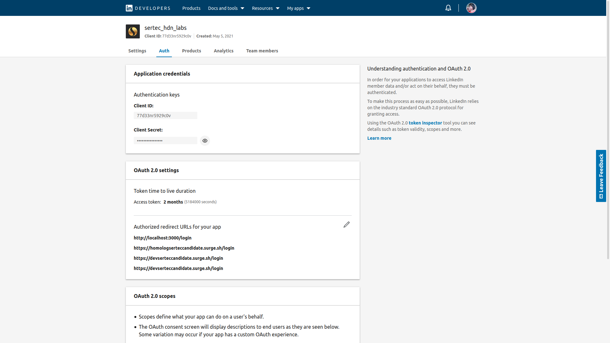

OAuth é um padrão aberto para autorização, comumente utilizado para permitir que os usuários da Internet possam
fazer logon em sites de terceiros usando suas contas do Google, Facebook, Microsoft, Twitter, etc.—mas, sem expor
suas senhas.

Geralmente esses serviços fornecem um token de acesso que pode ser usado pra pegar informações do usuário em questão, mas ele que escolhe se vai ou não dar acesso à aquilo que dele foi requisitado.

Cada serviço faz como quer em boa parte da implementação e de resto seguem alguns padrões, no que se refere ao LinkedIn,
pra pegar o token de acesso, fazemos o seguinte:

# Parte 1

Vem aqui e cria um app: www.linkedin.com/developers/apps e se houver opção para, adicione os produtos "Share on LinkedIn" e "Sign In with LinkedIn"

1.1 - Depois de criado, vá na aba "Auth":

Daqui você vai precisar de 3 coisas:

• Client ID = Uma sequência de bits usada pra representar de qual conta do LinkedIn é o App

• Client Secret = Uma sequência de bits usada pra ter acesso as operações do App em questão

• Redirect URL = Uma URL que representa pra onde o LinkedIn pode redirecionar o usuário após ele ter feito o Login na plataforma, aqui é onde você coloca alguma página da sua aplicação, o LinkedIn envia um parâmetro na URL chamado "code", que irei chamar aqui de token de verificação

# Parte 2

O client deve acessar a URL: https://www.linkedin.com/oauth/v2/authorization?response_type=code&client_id=CLIENT_ID&redirect_uri=REDIRECT_URL&scope=r_liteprofile%20r_emailaddress

REDIRECT_URL = Deve ser uma das redirect URL que você inseriu na aba "Auth"

CLIENT_ID = Deve ser seu Client ID

Os valores de "scope" é aquilo que sua aplicação pede acesso do usuário

Depois do usuário logar, o LinkedIn redireciona pra página da sua aplicação que você escolheu com REDIRECT_URL e nela envia um parametro na URL chamado "code", esse é o token de verificação que vamos usar pra o token de acesso do usuário em questão.
O retorno da URL é algo assim:

https://url-da-sua-aplicação.com/login?code=AQQlobNGR9FymXN238QG5jcxla7OuEVSBDpg6lieDpSQ_048ZOCaDyCOlJoT2nzUfRUBHFhUPqEQ04hWrKxgrnbsVvCfsoKo3r-wffX368Tm7yaQIYCGsm0LkS8NmbZk1ao5cpQiKIAMS9i7nQQv0J3pq_ljbBhjeyp_kZ6UeIM64K50QrBHyB4qw2fgVIy3TtkpTjUlteNYO1XboYA

# Parte 3

Com o token de verificação em mãos, envie ele pro servidor da sua aplicação.

Com o protocolo HTTP no método POST, acesse essa URL na porta 443:

www.linkedin.com/oauth/v2/accessToken

Envie como parâmetros da URL:

grant_type = Com o valor "authorization_code"
code = token de verificação
redirect_uri = Mesma REDIRECT_URL usada no client
client_id = Client ID da aplicação
client_secret = Client Secret da aplição

Se nenhum erro ocorrer, o que retornar é o token de acesso do usuário, com ele, pode pegar informações do usuário do linkedIn em questão